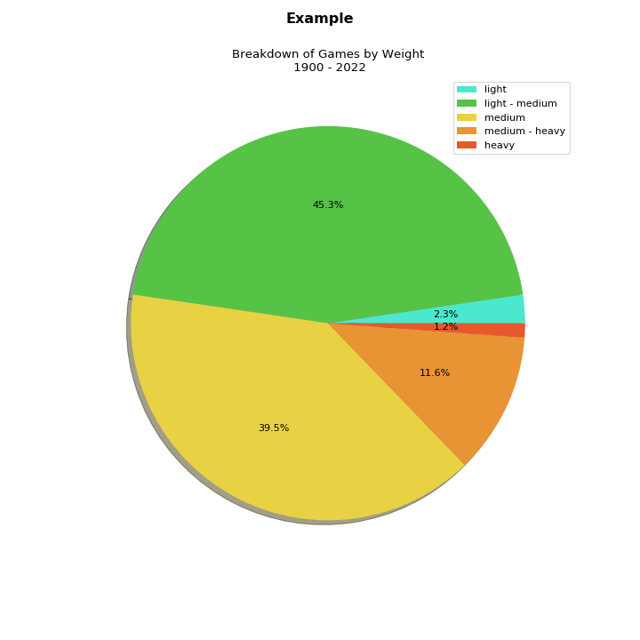

### Intro

The website boardgamegeek.com (bgg) consists of a database of more 
than fifty thousand board games along with their developers 
and players. Users can create profiles where the games they 
own are listed and ranked.

This repository contains a number of Python scripts that create
visualizations for the data in a user's collection. 

The main pre-requisite is downloading a user's collection 
data from bgg as is explained in https://boardgamegeek.com/wiki/page/Data_Mining

### Dependencies

matplotlib, numpy, pandas, requests, selenium

### Files:

+ **publication date histogram.py**

  Creates a simple histogram of the user's game 
  collection by publication date.

+ **date and weight histogram.py**

  Plots a *stacked* histogram of the publication date
  for the games in a user's collection with colors for each weight
  class.

  
+ **weight pie charts.py**

    Plots the pie chart of the weight classes for the games in a user's collection.

+ **mechanisms user.py**

    Obtains the list of game mechanisms (see https://en.wikipedia.org/wiki/Game_mechanics) 
from a user's collection, saves
it to csv file and prints the top 20.

+ **mechanism bar chart.py**

    This script plots a horizontal bar chart with
a user's percentage of game mechanisms compared
to the percentage in the bgg database. 

